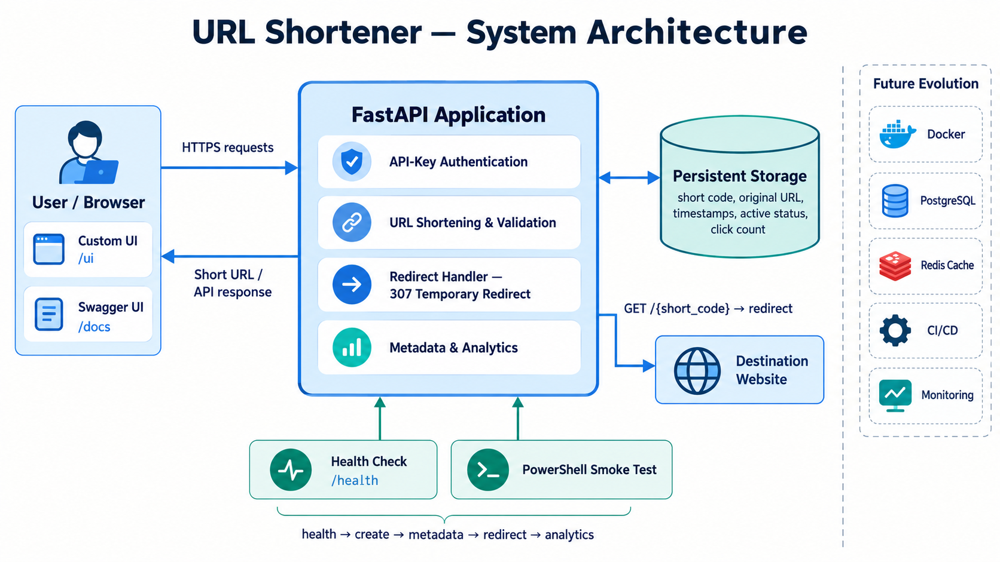
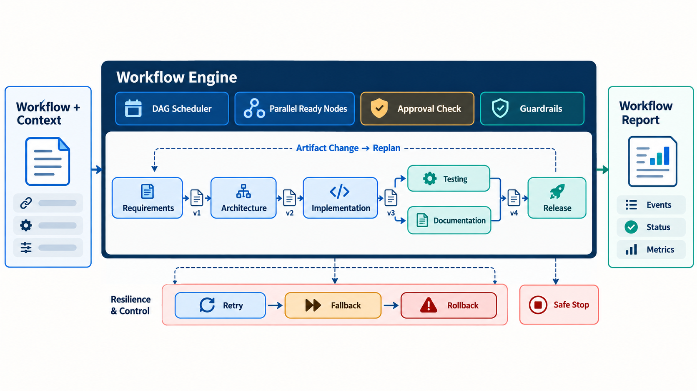

# URL Shortener Architecture

## Overview

This application turns long web addresses into short, shareable URLs. It exposes a lightweight browser interface at `/ui`, a REST API for programmatic access, and interactive Swagger documentation at `/docs`.

The repository also includes an agentic SDLC orchestration engine that models governed, dependency-aware workflows with approvals, retries, fallbacks, rollback, and audit metrics.

## Runtime Components

1. **Web UI and API layer** ([`app/main.py`](../app/main.py))
   - Serves the embedded HTML interface at `/ui`.
   - Provides endpoints for URL creation, redirects, metadata, analytics, and health checks.
   - Enforces authentication on management APIs and applies request rate limiting.
2. **Domain service** ([`app/service.py`](../app/service.py))
   - Enforces URL lifecycle rules, short-code uniqueness, expiration, active status, and analytics recording.
3. **Persistence layer** ([`app/repository.py`](../app/repository.py))
   - Uses SQLite with normalized tables:
     - `urls` stores canonical short-link records.
     - `click_events` stores redirect analytics events.
4. **Agentic orchestration engine** ([`orchestrator/engine.py`](../orchestrator/engine.py))
   - Executes dependency-graph workflows across SDLC stages with reliability and governance controls.
5. **Operational verification** ([`scripts/smoke_test.ps1`](../scripts/smoke_test.ps1))
   - Tests the critical path from health check through URL creation, lookup, redirect, and analytics.

## URL Shortener Request Flow

1. A user enters a destination URL in the interface at `/ui`.
2. The interface calls `POST /api/v1/shorten` with an `X-API-Key` header.
3. The API validates the request and passes it to the domain service.
4. The service selects a custom alias or generates a unique short code, then persists the URL with its creation time, optional expiration, and active status.
5. The API returns a short link such as `http://127.0.0.1:8000/huPLhF2`.
6. When the link is opened, `GET /{short_code}` verifies that the record is active and unexpired, records the click, and responds with an HTTP `307 Temporary Redirect`.
7. Protected endpoints expose URL metadata and aggregated click analytics.

## API Surface

- `POST /api/v1/shorten` creates a short URL.
- `GET /{short_code}` records a click and redirects to the destination.
- `GET /api/v1/urls/{short_code}` returns URL metadata.
- `GET /api/v1/analytics/{short_code}` returns aggregated analytics.
- `GET /health` reports service health.
- `GET /ui` serves the browser interface.
- `GET /docs` serves interactive Swagger documentation.

## Security and Runtime Reliability

### Authentication

- Management routes under `/api/v1/*` require `X-API-Key` or `Authorization: Bearer <key>`.
- The key is configured through `SHORTENER_API_KEY`.
- Missing or invalid credentials return `401 Unauthorized`.
- Public redirect routes remain accessible to anyone who has the short link.

### Rate Limiting

- An in-memory fixed-window limiter groups requests by client host and route class.
- API and redirect traffic have separate configurable quotas.
- Requests that exceed a quota receive `429 Too Many Requests` with a `Retry-After` header.

### Link Lifecycle

- Links can expire or be marked inactive.
- Expired and inactive records no longer redirect.
- Redirect analytics are stored separately from canonical URL records.

## Agentic Orchestration Model

The repository provides two orchestration paths with different purposes:

- [`orchestrator/sample_workflows.py`](../orchestrator/sample_workflows.py) contains deterministic
  greenfield, brownfield, and ambiguous scenarios. They exercise orchestration controls without
  modifying application code.
- [`orchestrator/real_workflow.py`](../orchestrator/real_workflow.py) connects those concepts to real
  engineering work. It invokes Codex for structured requirements, impact analysis, staged
  implementation, and independent review; deterministic tools perform test and compilation
  validation before a human-approved promotion.

The URL shortener remains the engineering product. The orchestration layer is a separate control
plane that can produce a bounded, reviewable change to that product; it is not involved when the
URL-shortening API handles normal requests.

### How to Read the Diagram

The workflow definition and run context enter the `WorkflowEngine`, which uses the DAG scheduler to select every pending node whose dependencies have succeeded. Those ready nodes can execute concurrently up to the configured `max_parallelism`; in the illustrated greenfield flow, testing and documentation run in parallel after implementation and must both complete before release.

Before a protected node runs, the engine evaluates its human-approval checkpoint and configured guardrails. The release stage is allowed only when approval is present and both the security and compliance checks have passed. A denied checkpoint or failed guardrail blocks progress and is recorded in the workflow event stream.

Each successful node publishes versioned artifacts for downstream consumers. When an upstream artifact changes, completed dependents that observed an older version are marked pending and re-queued, producing the diagram's replan loop. Execution failures follow a bounded recovery path: retry according to `RetryPolicy`, use a fallback when one is defined, and invoke rollback after a terminal failure. A safe-stop request halts scheduling deterministically.

At completion, the engine returns a `WorkflowReport` containing the final status, accumulated context, timestamped events, and reliability metrics such as success rate, retry and rollback counts, MTTR, and end-to-end latency.

### Real-Workflow Safety Boundary

The real workflow never gives an implementation agent direct access to the source checkout. It copies
the repository into a temporary staging workspace, snapshots file hashes, and compares the result
against an explicit path allowlist. Deletions or out-of-scope modifications fail the workflow and are
not promoted. Real tests and compilation checks run in staging, followed by a separate read-only review.
Only an approved set of validated files is copied back; the workflow does not commit, push, or deploy.

Each Codex call uses a JSON output schema and writes its prompt, structured response, standard output,
and standard error to the run audit directory. The final report combines that evidence with workflow
events, approvals, changed paths, validation results, review findings, and reliability metrics.

### Dependency Graph and Non-Linear Execution

Each workflow node declares:

- `deps` for predecessor nodes;
- `consumes` and `produces` for versioned artifacts;
- a `retry_policy` and optional `fallback` and `rollback` handlers; and
- an optional `requires_approval` checkpoint for high-impact actions.

Ready nodes execute in parallel waves using `ThreadPoolExecutor` and synchronize when their dependencies complete. If an upstream artifact version changes, affected downstream nodes are marked stale and queued again, enabling dynamic replanning.

### Entry and Exit Gates

Entry gates require:

- dependency completion;
- successful security and compliance guardrail checks; and
- approval callbacks for high-impact nodes.

Exit gates evaluate:

- the node result status;
- artifact version updates; and
- the terminal workflow status: `succeeded`, `failed`, or `blocked`.

### Reliability and Governance Controls

- Bounded retries with configurable backoff through `RetryPolicy`.
- Safe fallback paths when nodes fail.
- Rollback hooks for terminal failures.
- A safe-stop signal for deterministic shutdown.
- Release guardrails requiring both `security_scan_passed` and `compliance_check_passed`.

### Observability and Traceability

The engine emits timestamped `WorkflowEvent` entries containing node, action, and detail data. Its `WorkflowReport` includes workflow status, contextual outputs, event history, and reliability metrics:

- success rate;
- retry frequency;
- rollback frequency;
- mean time to recovery (MTTR); and
- end-to-end latency.

## Future Improvements

- **Containerization:** Package the application with Docker and add Docker Compose for local development.
- **Production persistence:** Move to PostgreSQL with migrations, indexes, connection pooling, backups, and retention policies.
- **Stronger authentication:** Use managed secrets, key rotation, and per-client credentials; describe the API-key scheme in OpenAPI so Swagger provides an **Authorize** action.
- **Caching and scale:** Add Redis for redirect lookups and distributed rate limiting, then run stateless application instances behind a load balancer.
- **Background analytics:** Record click events asynchronously so analytics processing does not delay redirects.
- **Observability:** Add structured logs, tracing, metrics, dashboards, and alerts for latency, failures, and unusual traffic.
- **Testing and delivery:** Expand unit, integration, security, and load testing, and run it automatically in CI/CD.
- **Operational hardening:** Add HTTPS, configuration validation, secret management, abuse protection, custom domains, and expired-link cleanup.
